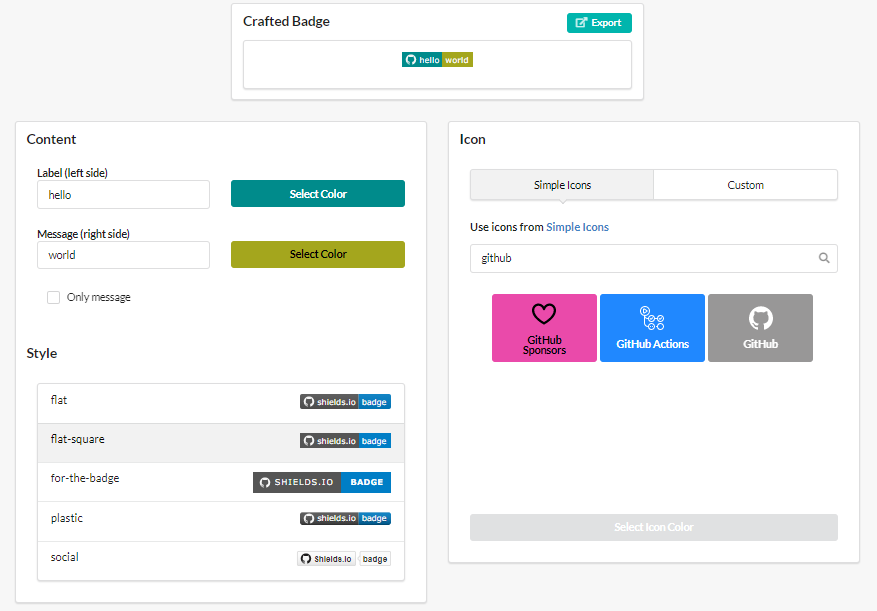

# 

**Shields Craft** helps to create [Shields.io](http://shields.io/) badges easily.

-   [English](README.md)
-   [한국어](README.ko.md)

## Getting Started

[tekiter.github.io/shields-craft](https://tekiter.github.io/shields-craft)

## Introduction

[Shields.io](http://shields.io/) is very useful service for creating badges. You can create your own badge free and put it in your repository's README.

However, styling this badge in [Shields.io website](http://shields.io/) is challenging.

You might...

1. Find out which options you can use.
2. Build URL query string of options **by hand**.
3. Append query string to badge's URL.
4. Put the URL in your browser's address bar.
5. Check how it looks.
6. Repeat 1-5 until you are happy with the badge.

Repeating this is quite annoying.

ShieldsCraft creates badge's URL for you. All you have to do is just clicking.

## Features

-   Style options GUI
-   Badge preview
-   Color picker
-   Logo Selector
-   Export badge as URL/Markdown/HTML

Only Static Badge is currently supported.

## Tech Stack

-   Typescript
-   React
-   Next.js
-   Semantic UI React
-   Storybook

## Development

1. Install Node 12+ and yarn.
2. Clone this repository.
3. Run `yarn install` to install dependencies.
4. Run `yarn dev` to start dev server.
5. Run `yarn storybook` to start storybook server.

To build and generate static HTML, run `yarn build` then `yarn export`.

## License

Project License can be found [here](LICENSE.md).

All generated badges are coming from [Shields.io](https://github.com/badges/shields).
